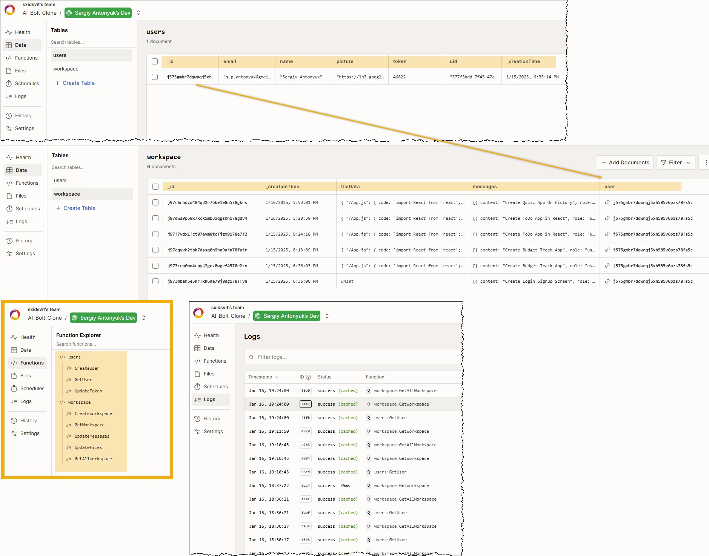

# AI Bolt.New Clone

## Overview

AI Bolt.New Clone is a fully equipped SaaS application built using advanced technologies: 
* Next.js for frontend, 
* Tailwind CSS for styles, 
* Google OAuth2 for authorization, 
* Gemini models to generate artificial intelligence 
* Convex for database.


[Site](https://ai-bolt-clone-sxidsvit.vercel.app/)

## Target Audience

Individuals interested in developing artificial intelligence applications..

---

 

---


## Tech Stack

**Frontend (Client-Side):**

* **Next.js 15:** Provides a robust and performant foundation for the user interface.

* **Tailwind CSS & Shadcn UI:** Enables the creation of a visually appealing and responsive user interface.

* **@codesandbox/sandpack-react:** React components that give you the power of editable sandboxes that run in the browser.

* **@react-oauth/google:** Google OAuth2 using the new Google Identity Services SDK for React.

* **@paypal/react-paypal-js":**  Provides a solution to developers to abstract away complexities around loading the JS SDK. It enforces best practices by default so buyers get the best possible user experience.

* **react-markdown:** React component to render markdown.


**Backend (Server-Side):**

* **Convex** Open-source reactive database for web app developers 


 

---
<br />

 *Configuration: Make sure to create a `.env` file with following variables*

```js
NEXT_PUBLIC_GOOGLE_AUTH_CLIENT_ID_KEY=

CONVEX_DEPLOYMENT=

NEXT_PUBLIC_CONVEX_URL=

CONVEX_DEPLOY_KEY=

NEXT_PUBLIC_GEMINI_API_KEY=

NEXT_PUBLIC_PAYPAL_CLIENT_ID=

```

## Getting Started

1. Visit the AI Bolt.New Clone website: [Site](https://ai-bolt-clone-sxidsvit.vercel.app/)
2. Create an account using the secure sign-up process.
3. Explore the platform's features and functionalities.


## Contact:

[][linkedin]

[linkedin]: https://www.linkedin.com/in/sergiy-antonyuk/

---

##### Acknowledgements

*A special thanks to [you](https://www.youtube.com/@tubeguruji) for your invaluable contributions and inspiration.*
